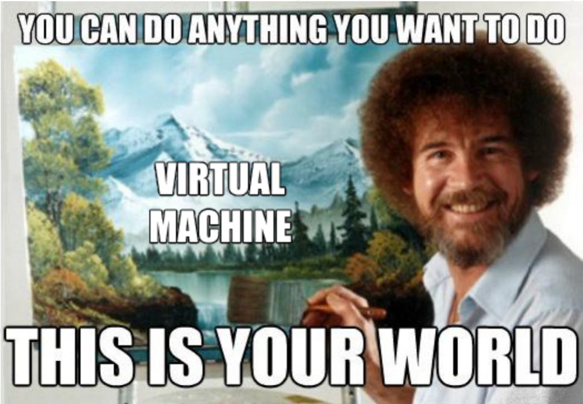
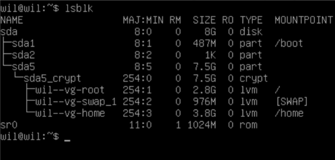

# **Born2beRoot**

_요약: 이 문서는 시스템 관리에 대한 과제를 담고 있습니다._

<br>

# **Contents**

| Chapter | Contents                                         | page |
| :-----: | :----------------------------------------------- | :--: |
|    1    | [**Preamble**](#Chapter-1)                       |  2   |
|    2    | [**Introduction**](#Chapter-2)                   |  3   |
|    3    | [**Gereral guidelines**](#Chapter-3)             |  4   |
|    4    | [**Mandatory part**](#Chapter-4)                 |  5   |
|    5    | [**Bonus part**](#Chapter-5)                     |  9   |
|    6    | [**Submission and peer-evaluation**](#Chapter-6) |  11  |

<br>

# **Chapter 1**

## Preamble

<br>



```
YOU CAN DO ANYTHING YOU WANT TO DO
네가 하고 싶어하는 모든 일들을 여기서 해낼 수 있단다

(VIRTUAL MACHINE)
(가상 머신)

THIS IS YOUR WORLD
여긴 네 세상이니까!
```

<br>

# **Chapter 2**

## Introduction

이 프로젝트는 여러분을 멋진 가상화 (Virtualization)의 세계로 안내해 드릴 것을 목표로 합니다.

여러분은 특정한 절차를 따라 여러분의 첫 번째 VirtualBox 머신을 만들 것입니다. 그리고, 프로젝트의 끝에선 여러분만의 운영 체제를 엄격한 규칙을 따르면서 설정할 수 있게 될 겁니다.

<br>

# **Chapter 3**

## General guidelines

- `Virtualbox`의 사용은 필수적입니다.

- 과제 제출 시에는, git 저장소 (repository) 의 루트에 `signature.txt`만 제출하면 됩니다. 해당 파일에는 반드시 여러분이 만든 머신의 디스크 서명 (Disk Signature) 을 붙여 넣어야 합니다. 더 많은 정보는 [**Submission and peer-evaluation**](#Chapter-6) 챕터를 참고하세요.

<br>

# **Chapter 4**

## Mandatory part

<br>
이 프로젝트는 다음과 같은 규칙을 따르면서 첫 번째 서버를 설정하기를 요구합니다.

```
⚠️
서버를 설정하는 문제이기 때문에, 여러분은 최소한 적은 개수의 서비스를 설치해야 합니다. 이러한 이유 때문에, 그래픽 인터페이스는 사용되지 않습니다. X.org나 다른 비슷한 그래픽 서버를 설치하는 것도 금지합니다. 사용할 경우, 점수는 0점이 될 것입니다.
```

여러분은 사용할 운영체제로 `Debian` 최신 stable 버전 (테스팅 / unstable 버전은 사용하지 마세요) 도는 `CentOS` 최신 stable 버전 중 하나를 선택할 수 있습니다. 만약 시스템 관리가 처음이라면, `Debian`을 적극 추천합니다.

```
ℹ️
CentOS 설정은 비교적 까다롭습니다. 그렇기 때문에, 여러분은 굳이 KDump까지 설정하실 필요가 없습니다. 허나, SELinux는 시작 시에 구동되어야 하고, 프로젝트의 요구에 맞추어 설정되어 있어야 합니다. Debian의 AppArmor 또한 시작 시에 구동되어야 합니다.
```

여러분은 LVM을 이용하여 최소 2개의 암호화된 파티션을 생성해야 합니다. 아래의 그림은 그 예시입니다 :



```
ℹ️
동료평가 시에는, 여러분이 선택한 운영체제에 대해 몇 가지 질문을 받을 것입니다. 예를 들면, 여러분은 aptitude와 apt의 차이점을 알고 있어야 하고, SELinux 또는 AppArmor이 무엇인지 알고 있어야 합니다. 요약하자면, 여러분이 사용하는 것에 대해 충분히 공부하세요!
```

SSH 서비스는 4242 포트에서만 작동해야 합니다. 보안상의 문제 때문에, SSH를 이용한 root 연결을 허용하면 절대 안 됩니다.

```
ℹ️
동료평가에서, 새로운 계정을 생성하여 SSH의 동작을 테스트할 것입니다. 그러므로 여러분은 SSH가 어떻게 동작하는 지 잘 알아 두어야 합니다.
```

여러분은 `UFW` 방화벽을 이용하여 운영체제를 설정해야 하므로, 오직 4242 포트만 열어 두어야 합니다.

```
ℹ️
여러분의 가상 머신을 실행시켰을 때, 방화벽이 반드시 활성화되어야 합니다. CentOS는 기본 방화벽 대신 UFW를 사용하여야 합니다. 이를 설치하기 위해선 DNF가 필요할 것입니다.
```

- 여러분의 가상머신의 `호스트명` 은 로그인 아이디 뒤에 42를 붙인 형식이 되어야 합니다. (예를 들면, wil42)
- 여러분은 강한 비밀번호 체계를 도입해야 합니다.
- 여러분은 엄격한 규칙 하에 `sudo`를 설치하고 설정하여야 합니다.
- 루트 사용자

<br>

# **Chapter 5**

## Bonus part

```
⚠️
보너스는 필수로 구현해야 하는 파트가 완벽할 때만 평가될 것입니다. 저희가 말하는 '완벽함' 이란, 어떠한 경우에도 - 잘못된 사용과 같은 끔찍한 실수 등 - 실패하지 않고 동작해야 한다는 의미입니다. 쉽게 말하자면, 필수로 구현해야 하는 파트에서 만점을 받지 못한다면, 보너스는 완전히 '무시될' 것입니다.
```

보너스 목록:

- 벽 충돌
- 스카이박스
- 바닥과 천장 텍스처 추가하기
- HUD
- 위와 아래로 시선 전환 기능
- 점프하거나 웅크리기
- 거리에 따른 그림자 효과
- HP 바
- 미로 속에 더 많은 아이템 추가하기
- 물체 (Object) 끼리의 충돌
- 물체 또는 함정을 건드림으로써 포인트를 획득하거나 HP (생명) 이 깎이도록 하기
- 열고 닫을 수 있는 문
- 비밀 문
- 총 발사 애니메이션 또는 움직이는 스프라이트
- 여러 개의 레벨
- 사운드이펙트와 배경음악
- 마우스로 시점 전환
- 무기와, 맞서 싸워야 할 나쁜 악당들!

```
💡
모든 보너스 포인트를 얻기 위해서는 최소한 14개의 요소를 검증해야 하므로, 현명하게 선택하되 시간 낭비를 하지 않도록 주의하세요!
```

```
ℹ️
평가 중에 다른 기능을 사용하는 것이 정당화될 때에 한해서, 보너스 파트를 완성하기 위해 그것을 사용해도 됩니다.
또한 사용할 화면 파일 형식을 필요에 맞게 수정할 수 있습니다.
현명하게 과제를 수행해 보세요! (Be smart!)
```

<br>

# **Chapter 6**

## Bonus part

```
그림 VI.1
```

<center>그림 VI.1: RayCasting을 사용한 오리지널 게임 Wolfeinstein3D.</center>

```
그림 VI.2
```

<center>그림 VI.2: 필수 과제를 수행했다면 구현되어야 할 예시 </center>

```
그림 VI.3
```

<center>그림 VI.3: 미니맵, 바닥 및 천장 텍스쳐, 움직이는 유명한 고슴도치 스프라이트를 추가한 보너스 예시 </center>

```
그림 VI.4
```

<center>그림 VI.4: HUD, 생명 바, 사운드이펙트, 배경음악, 그림자 효과, 총을 구현한 보너스 예시 </center>

```
그림 VI.5
```

<center>그림 VI.5: 다른 무기로 전환하고 천장을 보고 있는 보너스 예시</center>
